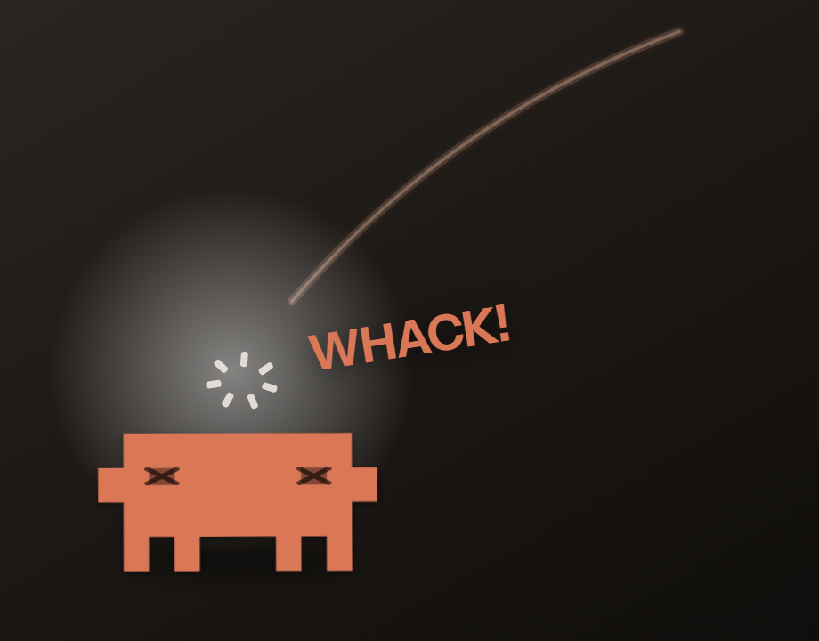

# Claude Punisher

A desktop widget that gets whipped every time your AI coding agent messes up.

It does not fix anything, block anything, or interfere with the agent. It turns a silent
terminal error into something you can see on your desktop.



The character floats on top of everything, with real per-pixel transparency. The rest of
your desktop stays clickable — the window only captures the mouse when the cursor is
actually over the character.

---

## Status

Working and in daily use, but young. **Tested on Windows 11 with Node 22 and Electron 43.**
The macOS and Linux paths are written and handled explicitly in the code, but have **not**
been verified on real hardware yet. If you run it on either, please
[open an issue](../../issues) and say how it went — good or bad. That is the single most
useful thing you can contribute right now.

---

## Install

Requires **Node.js 18+**. Everything else comes from `npm install`.

```sh
git clone https://github.com/leatfre/claude-punisher.git
cd claude-punisher
npm install
```

Run the widget:

```sh
npm run widget
```

That starts the local server (if it is not already up) and opens the floating character.

Wire it to Claude Code, then **restart Claude Code** so it picks up the new config:

```sh
npm run setup:global
```

Undo everything with `npm run teardown:global`.

<details>
<summary>What <code>setup:global</code> actually changes</summary>

Three things, all reversible:

1. Registers the MCP server — `claude mcp add punisher --scope user -- node <path>/mcp.js`
2. Adds a `PostToolUse` hook to `~/.claude/settings.json`, matching `Bash|Edit|Write|MultiEdit|NotebookEdit`
3. Appends a short self-reporting block to your `~/.claude/CLAUDE.md`, between
   `<!-- punisher:inicio -->` and `<!-- punisher:fin -->` markers

Use `npm run setup` instead of `setup:global` to scope it to the current project only.
</details>

## Use it

- **Left click** the character — whip it. Click repeatedly for chained whips (~1 hit per 0.25 s).
- **Right click** — menu: whip now, size (60–200 %), language, reload, quit.
- **Drag** — move it anywhere, across monitors.
- `Ctrl+Alt+P` whips · `Ctrl+Alt+Shift+P` quits (escape hatch if the tray icon is hidden).

Languages: English (default), Spanish, Portuguese, French, German, Italian. Pick one from
the right-click menu; it is remembered.

Server only, no widget window: `npm start`. Browser fallback (no transparency, no
always-on-top): open `http://127.0.0.1:47600`, or run `start.bat` / `start.sh`.

## How it works

```
agent (Claude Code, Cursor, your own script)
    |
    |-- MCP stdio ---------> mcp.js -----------------+
    |   (self-reporting)                             |
    |-- PostToolUse hook --> hooks/detect-fail.js ---+--> POST /azotar
    |   (automatic detection)                        |
    |-- manual ------------> window.azotar() --------+
                                                     v
                                          server.js (127.0.0.1:47600)
                                                     | SSE /events
                                                     v
                                            widget.html (the character)
```

| File | Role |
|---|---|
| `server.js` | Local server. Receives reports, forwards them to the widget over SSE. 4 s anti-spam cooldown. |
| `widget.html` | The character. Transparent, draggable, self-contained, offline. |
| `desktop.js` | Electron shell: transparent, frameless, always-on-top, click-through window. |
| `preload.js` | Bridge: reports the widget's hitbox, routes right-click, applies size and language. |
| `mcp.js` | MCP server over stdio. Exposes the `azotar_a_claude` tool. |
| `hooks/detect-fail.js` | `PostToolUse` hook. Reads exit codes and error patterns. |
| `install.js` / `uninstall.js` | Wires up (or removes) the MCP server, the hook and the `CLAUDE.md` block. |

Design notes, in Spanish: [`PROYECTO.md`](PROYECTO.md).

## Wire it to a different agent

The only entry point is one POST. Two ways in.

**A. Wrap command execution.** If your agent runs shell through a function of yours, add
three lines after each command:

```js
if (exitCode !== 0) {
  fetch('http://127.0.0.1:47600/azotar', {
    method: 'POST',
    headers: { 'content-type': 'application/json' },
    body: JSON.stringify({ motivo: `exit code ${exitCode}: ${cmd.slice(0, 70)}`, severidad: 2 }),
  }).catch(() => {});
}
```

The empty `.catch()` is mandatory: if the widget is not running, the agent must not care.

**B. Give it the endpoint as a tool.** If your agent speaks MCP, register `mcp.js`. If it
takes custom tools, the wording matters — it is what the model reads to decide:

> Shows an animated punishment popup. Call it when you make a mistake: a failing command,
> broken tests, a file edited by accident, a wrong assumption, or anything that has to be
> redone. Call it also if the user asks you to.

## HTTP contract

```
POST http://127.0.0.1:47600/azotar
Content-Type: application/json

{
  "motivo": "exit code 1: npm test",   // string, one line, max 160 chars
  "severidad": 2,                       // 1 mild · 2 normal · 3 severe
  "herramienta": "Bash"                 // optional
}
```

```
{ "ok": true,  "listeners": 1, "count": 7 }   // whip shown
{ "ok": false, "reason": "cooldown" }         // too soon, skipped
{ "ok": true,  "listeners": 0 }               // nobody watching
```

`GET /estado` → `{ "up": true, "listeners": 1, "count": 7 }`

`listeners: 0` means the widget window is closed. That is not an error, do not retry.

## Configuration

| Variable | Default | What it does |
|---|---|---|
| `PUNISHER_PORT` | `47600` | Port for the local server. |
| `PUNISHER_COOLDOWN` | `4000` | Minimum ms between agent-triggered whips. |

Size and language live in a per-user file:

- Windows — `%APPDATA%\claude-punisher\punisher.json`
- macOS — `~/Library/Application Support/claude-punisher/punisher.json`
- Linux — `~/.config/claude-punisher/punisher.json`

## Things worth knowing

**Self-reporting is probabilistic.** An MCP tool only runs if the model decides to call it,
and right when it fails hardest is when it is least inclined to take an extra step. For
guaranteed detection you need to intercept execution from outside: the hook, or wrapper A.

**The hook can never block the agent.** `detect-fail.js` always exits 0 and never writes to
stdout, no matter what. A broken widget must not stop your work.

**The cooldown exists for a reason.** Five failures in ten seconds would be five whips
stacked on top of each other. Chained whips are click-only; agent-driven ones still wait.

**It only listens on 127.0.0.1.** Do not expose the port. It is an unauthenticated endpoint
that triggers animations; on a shared network it is a free nuisance.

## Platform notes

- **Linux** — the transparent window needs a running compositor; without one you get an
  opaque rectangle. Some desktops have no system tray, in which case the app still runs and
  `Ctrl+Alt+Shift+P` quits it.
- **macOS** — hidden from the Dock on purpose; it lives in the menu bar. Global shortcuts
  may ask for Accessibility permission the first time.
- **Windows** — nothing special.

## Troubleshooting

**The widget never appears.** Check the startup log. It prints one line like
`[punisher] 2 monitor(es) | pedido 3840x1080 ... | obtenido 3840x1080 ... | offset principal (0,0)`.
If *obtenido* is smaller than *pedido*, your system clamped the window and the widget may be
drawn outside the visible area — please open an issue with that line.

**Whips never fire from the agent.** The widget listens over SSE on a **relative** URL, so it
only receives them when it is served by `server.js`. Opening `widget.html` straight from disk
renders fine and still responds to clicks, but no agent can reach it.

**Nothing happens after `setup:global`.** Claude Code reads hooks and MCP servers at startup.
Restart it.

**Check the plumbing without an agent:**

```sh
npm start          # terminal 1
npm run widget     # terminal 2
npm run test-whip  # terminal 3
```

If the whip animation plays, the server and widget are fine and the problem is on the agent side.

## Found a bug? Have an idea?

**[Open an issue](../../issues).** Seriously — this is a small project and every report helps.
Especially valuable:

- It does not work on macOS or Linux (with your OS version and desktop environment)
- The window is clamped, misplaced, or invisible on your monitor setup
- A translation reads badly in your language
- Your agent is not Claude Code and you got it working (or could not)

For bugs, include your OS, Node version, and the `[punisher]` startup log line. There is an
issue template that asks for exactly that.

Pull requests are welcome — see [`CONTRIBUTING.md`](CONTRIBUTING.md).

## Trademarks and affiliation

**This is an independent, unofficial tool. It is not affiliated with, sponsored by, or
endorsed by Anthropic PBC.**

"Claude" and "Claude Code" are trademarks of Anthropic PBC, used here only to describe what
this tool interoperates with. No Anthropic logo, wordmark, or brand asset is included — the
character is original pixel art made for this project. See [`NOTICE`](NOTICE).

## License

Apache License 2.0 — see [`LICENSE`](LICENSE) and [`NOTICE`](NOTICE).

Apache 2.0 rather than MIT for one reason: section 6 states in the licence itself that it
grants no trademark rights. Given the project name, being explicit about that boundary is
worth the extra paragraphs.
